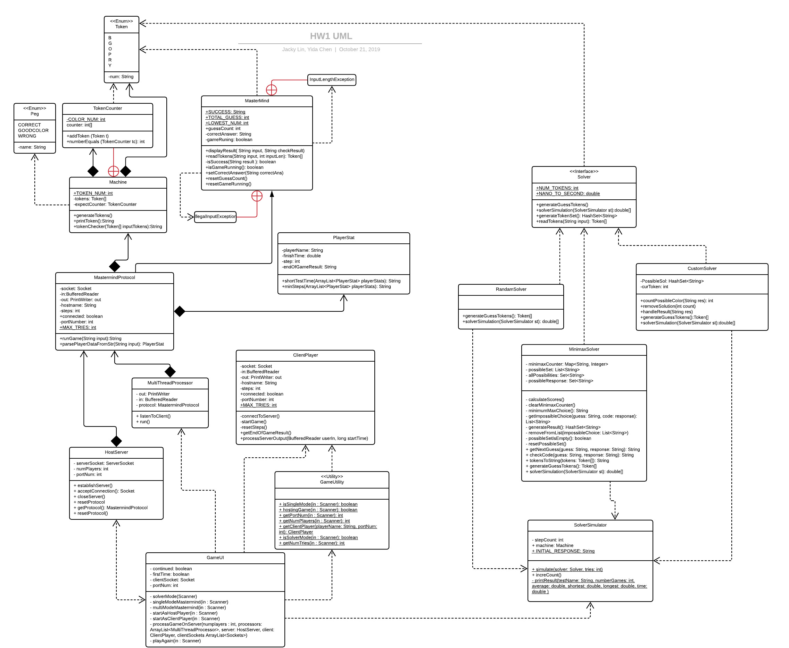

# Mastermind
#### 
**Course: CSCI-205 Software Engineering**

**Instructor: Professor Brian King**

**Team Members: Yida Chen, Jacky Lin**
****
#### References
Below are the resource we used to complete our project:

1.<a href="https://docs.oracle.com/javase/tutorial/displayCode.html?code=https://docs.oracle.com/javase/tutorial/networking/sockets/examples/KnockKnockClient.java">
Oracle Java Tutorial Code Sample - KnockKnockClient.java</a>

2.<a href="https://docs.oracle.com/javase/tutorial/displayCode.html?code=https://docs.oracle.com/javase/tutorial/networking/sockets/examples/KnockKnockServer.java">
Oracle Java Tutorial Code Sample - KnockKnockServer.java</a>

3.<a href="https://docs.oracle.com/javase/tutorial/displayCode.html?code=https://docs.oracle.com/javase/tutorial/networking/sockets/examples/KnockKnockProtocol.java">
Oracle Java Tutorial Code Sample - KnockKnockProtocol.java</a>

4.<a href="https://stackoverflow.com/questions/10131377/socket-programming-multiple-client-to-one-server">
Stack Overflow - Socket programming multiple client to one server</a>

5.<a href="https://github.com/nattydredd/Mastermind-Five-Guess-Algorithm">
Github Nathan Duran - Mastermind-Five-Guess-Algorithm</a>
****
#### Overview of the Project
Mastermind is a code-breaking game where one player make the code for another player to guess.
The purpose of the Mastermind project is to make the computer version of this code-breaking game
where the computer servers as the codemaker, and the user servers as the codebreaker. 

The user will use the console based interface to interact with the computer. User needs to guess
out the code within 12 steps to sucess. The code are four integer numbers, from 1 to 6, generated 
randomly by the computer. Computer will give hints to the user`s guess after each try of the user.
Hint "*" means user placed one number(Token) at the right spot, and a "_" means user place one number
that appears in the code but not placed the number into its right spot.

Users can run the Solver mode of the game in which they can choose one of three solvers, random solver,
minimax solver, or custom solver to simulate the games. The user can specify how many simulations they
want to have with the solver.

For the Game mode, the single player mode of this game doesn`t need any internet connections for the user to play.
The multiple player mode of this game needs connections among players to start the game. Players will
race with each other in the game to see who can guess out the code in the shortest time or with minimum
steps.
****
#### UML Diagram

****
#### Instructions
****
Enter S/s for the Solver mode of the game, or Enter G/g for the Game mode of the game.
****
#### Solver Mode
1. You will be aksed to enter the number of simulation you want.
2. You will be asked to choose one of three solvers, random solver, minimax solver, or custom solver to 
simulate the game. R/r for random solver, M/m for minimaxSolver, C/c for custom solver.
****
#### Game Mode
##### Single Player Mode
1. You will be asked if you want single mode or multi-player mode. 
   Enter S or s to start a single player mode.
2. You will have 12 guesses total, to reach the right answer
3. Input your guess with the number 1,2,3,4,5,6 as tokens.
4. If you enter a number larger than 6 or you input a character other than number.
   it will tell you "ILLEGAL INPUT CHARACTER! Please input only numbers from 1 to 6!"
5. If you enter a sequence of number longer than 4, 
   it will tell you "WRONG TOKENS NUMBER! Please choose only 4 tokens!"
6. If you try too many times (over 12 trials), you will lose game 
   and it will tell you the answers.
7. If you figure out the right answer, it will indicate you are win.
8. After game over, system will ask you if you want to play again, input y/Y to continue,
   enter other will quit the game.
****
##### Multiple Player Mode
1. You will be asked if you want single mode or multi-player mode. 
Enter M or m to start a multi-player mode.
  
2. You will be asked if you want to host the game or join the other's game.
Enter Y for hosting the game, or N for joining the other's game.
****
###### Start as the host player
1. You will be asked how many players will join your game.
2. You will be asked to enter the hostname of the host server.
3. You will be asked to enter the port number to establish your host server.
4. You will be asked to enter your player name or nickname. This name will be
   displayed to the other players and showed with your end of game statistics
   when everyone finished the game.
5. You will wait for the other players to join the game. The game will not start
   until every player has joined the game.
###### Start as the client player
1. You will be asked to enter the hostname shared by the host player.
2. You will be asked to enter the port number of the host server.
3. You will be asked to enter your player name or nickname. This name will be
   displayed to the other players and showed with your end of game statistics
   when everyone finished the game.
4. You will wait for the other players to join the game. The game will not start
   until every player has joined the game.
****
3.You will start the game when everyone has joined the game.

4.The game process is the same as the single player mode.

5.At the end of the game, the server will display who win the game
(guessing out the code) using shortest time or minimum steps.

6.The server will ask every player will you play the next round. The game
will restart if everyone responses yes, otherwise the game will finished,
and every player quits the games.
