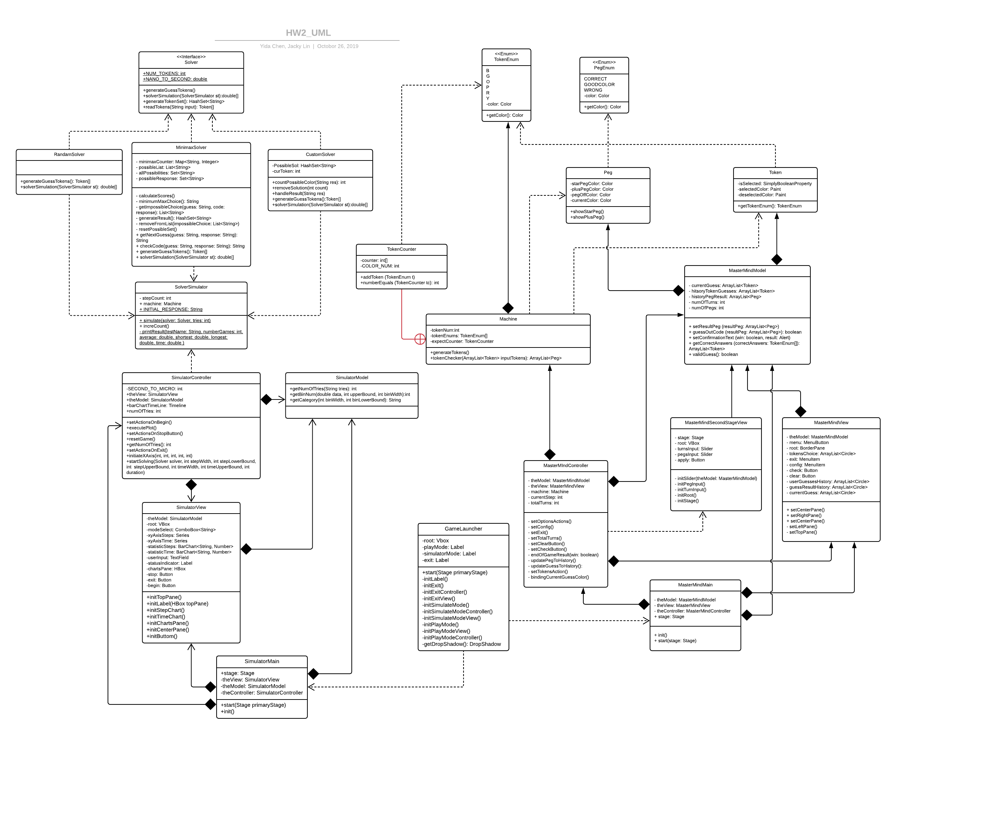

# Mastermind with GUI
#### 
**Course: CSCI-205 Software Engineering**

**Instructor: Professor Brian King**

**Team Members: Yida Chen, Jacky Lin**
****
#### References
Below are the resource we used to complete our project:

1. <a href="https://docs.oracle.com/javase/8/javafx/api/javafx/scene/control/Alert.html">Alert - Oracle Help Center</a>

2. <a href="https://docs.oracle.com/javafx/2/charts/bar-chart.htm">Oracle - Using JavaFX Charts: Bar Chart</a>

3. <a href="https://github.com/nattydredd/Mastermind-Five-Guess-Algorithm">Github Nathan Duran - Mastermind-Five-Guess-Algorithm</a>

****
#### Overview of the Project
Mastermind is a code-breaking game where one player make the code for another player to guess.
The purpose of the Mastermind project is to make the computer version of this code-breaking game
where the computer servers as the codemaker, and the user servers as the codebreaker. 

The user will use the graphical user interface to interact with the computer. User needs to guess
out the code within defined steps to success. The code are four colored tokens from six possible
colors (Blue, Green, Orange, Purple, Red, and Yellow). Computer will give hints to the user's guess 
after each try of the user. Black peg means user placed one Token at the right spot, and a white peg means
user place one token that appears in the code but not placed the number into its right spot.

Users can run the Solver mode of the game in which they can choose one of three solvers, random solver,
minimax solver, or custom solver to simulate the games. The user can specify how many simulations they
want to have with the solver.
****
#### UML Diagram

****
#### Instructions
****
In menu page, you can choose to Play the game, Simulate the game, or Exit.
****
#### Game Mode
If you choose to play the game:

1. You will click the six tokens on the left pane of the GUI, which represent the six
possible choice for guesses, to make your guess.
2. You can check your guess against the code from the computer by clicking check button after
you selected all four tokens.
3. You can also clear your guess before checking by clicking clear button.
4. The computer will give you hints based on your guess, a Black peg means you placed one Token 
at the right spot, White peg means you place one token that appears in the code but not placed the 
number into its right spot. 
5. You will win the game if you could guess out the code before using out of all tries. If you run
out of the tries without guessing out the code, you will lose.
6. You will be given the correct answers to the code at the end of the game, and you choose whether
to play another round or exit the game.
7. You can use configuration to change the available tries for guessing and how many tokens in each 
guess. 
****
#### Simulation Mode
If you choose to simulate the game:
1. You can choose three available solvers, minimax, random, or custom solver, to simulate the game.
2. You can specify how many times you want to simulate the game with chosen solvers.
3. After you specify the solvers and the number of simulation, you can click begin to start
the simulation.
4. The statistics of each simulation (used steps and used cpu time) will be updated to the
two Bar Charts dynamically.
5. You can reset the simulations during or after the simulations.
6. The status indicator on the top will present the status of the simulation.
